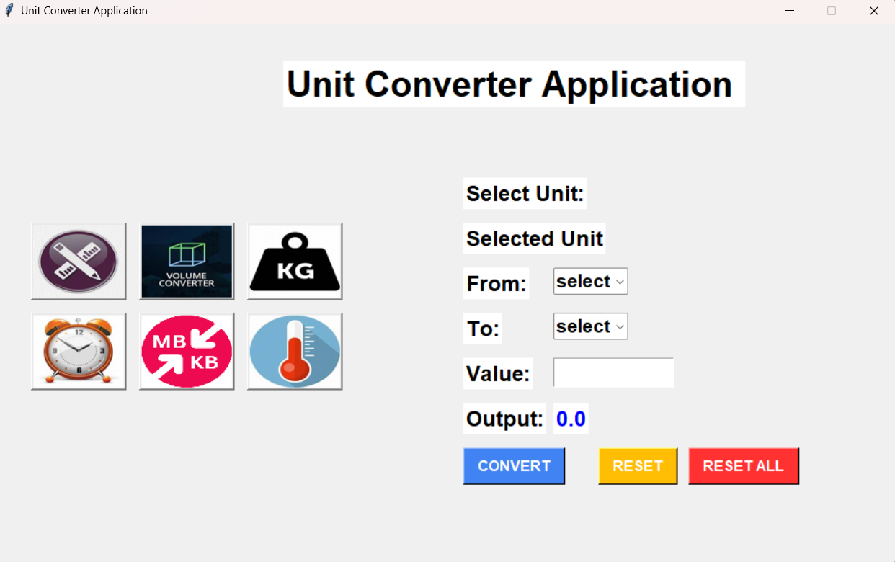
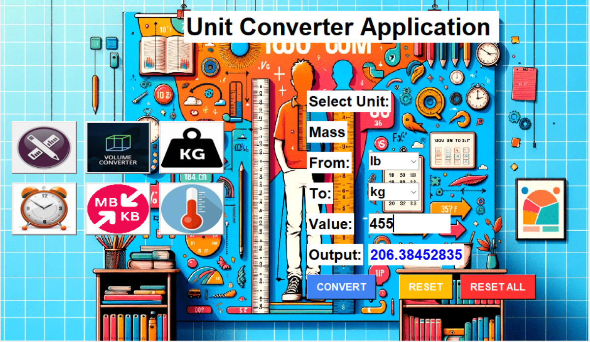

# 🧮 Unit Converter (Python)

A simple **GUI-based Unit Converter Application** built with **Python (Tkinter)**, **Pillow**, and **UnitConvert** library.  
It provides an easy-to-use interface with category icons, allowing users to quickly convert between different units such as Length, Mass, Volume, Time, Temperature, and Digital storage.

---

## 📸 Screenshot


## With Background


---

## 🚀 Features
- Convert between multiple units:
  - 📏 Length  
  - ⚖️ Mass  
  - 🧪 Volume  
  - ⏱️ Time  
  - 🌡️ Temperature  
  - 💾 Digital Storage  
- User-friendly GUI using **Tkinter**  
- Category icons for easy navigation  
- Instant conversions with reset options  

---

## 🔧 Installation & How to Run

1. Clone this repository:
   ```bash
   git clone https://github.com/<your-username>/unit-converter.git
   cd unit-converter
2. Install dependencies:
    ```bash
    pip install -r requirements.txt
3. Run the application:
    ```bash
    python unitconverter.py
---
## 🔮 Future Scope
- Add support for **currency conversion** using real-time exchange rate APIs.  
- Implement **history tracking** of conversions done by the user.  
- Provide **dark mode / theme customization** for the UI.  
- Export conversion results to **CSV or PDF**.  
- Package as a **desktop executable (.exe / .app)** for easy distribution.  
- Extend to **mobile version** using frameworks like Kivy or Flutter.  
---
## 📜 License
This project is open-source and free to use under the MIT License.
---
## Contact

Check out my GitHub profile [Intaza](https://github.com/Intaza)  
and visit this project repository [UNIT-CONVERTER](https://github.com/Intaza/UNIT-CONVERTER)

---
Thank You! 